# 📚 Book Streaming - System Diagrams

Complete UML and system diagrams for the Book-Streaming application.

---

## 1. Entity Relationship Diagram (ERD)

---

## 2. Class Diagram (Pydantic Models)

```mermaid
classDiagram
    class UserBase {
        +EmailStr email
        +str name
        +validate_email_format()
    }
    
    class UserCreate {
        +str password
        +validate_password_strength()
    }
    
    class UserLogin {
        +EmailStr email
        +str password
    }
    
    class UserUpdate {
        +Optional~str~ name
        +Optional~str~ password
    }
    
    class UserResponse {
        +str user_id
        +int last_streak
        +int current_streak
        +datetime created_at
    }
    
    class BookBase {
        +str title
        +str author_name
        +Optional~date~ publish_date
        +validate_title()
        +validate_author()
    }
    
    class BookCreate
    class BookUpdate {
        +Optional~str~ title
        +Optional~str~ author_name
        +Optional~date~ publish_date
    }
    
    class BookResponse {
        +str book_id
        +Optional~str~ user_id
        +bool is_verified
        +Optional~str~ cover_url
        +datetime created_at
    }
    
    class MarkedBookResponse {
        +datetime marked_at
    }
    
    class ReviewBase {
        +Optional~Decimal~ rating
        +Optional~str~ review_comment
    }
    
    class ReviewCreate
    class ReviewUpdate
    class ReviewResponse {
        +str id
        +str user_id
        +str book_id
        +datetime created_at
        +datetime updated_at
    }
    
    class ReadingSessionBase {
        +datetime start_time
        +Optional~datetime~ end_time
        +Optional~int~ duration_min
        +validate_times()
    }
    
    class ReadingSessionCreate
    class ReadingSessionResponse {
        +str id
        +str user_id
        +str book_id
        +datetime created_at
    }
    
    class Token {
        +str access_token
        +str token_type
        +UserResponse user
    }
    
    class FollowResponse {
        +str follower_id
        +str followed_id
        +datetime followed_at
    }
    
    class MarkResponse {
        +str user_id
        +str book_id
        +datetime marked_at
    }
    
    UserBase <|-- UserCreate
    UserBase <|-- UserResponse
    BookBase <|-- BookCreate
    BookBase <|-- BookResponse
    BookResponse <|-- MarkedBookResponse
    ReviewBase <|-- ReviewCreate
    ReviewBase <|-- ReviewUpdate
    ReviewBase <|-- ReviewResponse
    ReadingSessionBase <|-- ReadingSessionCreate
    ReadingSessionBase <|-- ReadingSessionResponse
```

---

## 3. Use Case Diagram

---

## 4. Sequence Diagrams

### 4.1 User Registration & Login

### 4.2 Reading Session Flow

### 4.3 Social Follow Flow

### 4.4 Book Review Flow

---

## 5. Deployment / Architecture Diagram

---

## 6. Activity Diagrams

### 6.1 User Dashboard Load

### 6.2 Add New Book

### 6.3 Reading Timer Session

---

## 7. Component Diagram (Frontend)

---

## 8. API Endpoints Summary Table

| Category | Method | Endpoint | Description |
|----------|--------|----------|-------------|
| **Auth** | POST | `/auth/register` | Register new user |
| | POST | `/auth/login` | Login & get JWT token |
| **Users** | GET | `/users/me` | Current user info |
| | PATCH | `/users/me` | Update profile |
| | GET | `/users/{id}/profile` | View public profile |
| | GET | `/users/search` | Search users |
| **Books** | GET | `/books` | List/search books |
| | POST | `/books` | Create book (multipart) |
| | GET | `/books/{id}` | Book details |
| | PUT | `/books/{id}` | Update book |
| | DELETE | `/books/{id}` | Delete book |
| | GET | `/books/stats` | Total book count |
| **Marks** | POST | `/books/{id}/mark` | Bookmark book |
| | DELETE | `/books/{id}/mark` | Remove bookmark |
| | GET | `/marks/me` | User's bookmarks |
| | GET | `/books/{id}/marked` | Check if marked |
| **Reviews** | GET | `/books/{id}/reviews` | Book reviews |
| | POST | `/books/{id}/reviews` | Create review |
| | PUT | `/reviews/{id}` | Update review |
| | DELETE | `/reviews/{id}` | Delete review |
| | GET | `/reviews/me` | User's reviews |
| | GET | `/books/{id}/reviews/summary` | Rating stats |
| **Sessions** | POST | `/books/{id}/sessions` | Start session |
| | PUT | `/sessions/{id}` | End session |
| | GET | `/sessions/me` | User's sessions |
| | GET | `/sessions/stats` | Reading stats |
| **Social** | POST | `/users/{id}/follow` | Follow user |
| | DELETE | `/users/{id}/follow` | Unfollow user |
| | GET | `/following/me` | Users I follow |
| | GET | `/followers/me` | My followers |
| | GET | `/users/{id}/follow/status` | Follow status |
| | GET | `/following/activity` | Activity feed |
| **Admin** | PATCH | `/books/{id}/verify` | Verify book |
| **Health** | GET | `/health` | API health check |

---

> **Note**: All diagrams use Mermaid syntax. You can render them in:
> - GitHub/GitLab Markdown
> - VS Code with Mermaid extension
> - [Mermaid Live Editor](https://mermaid.live)
> - Draw.io (import Mermaid)
